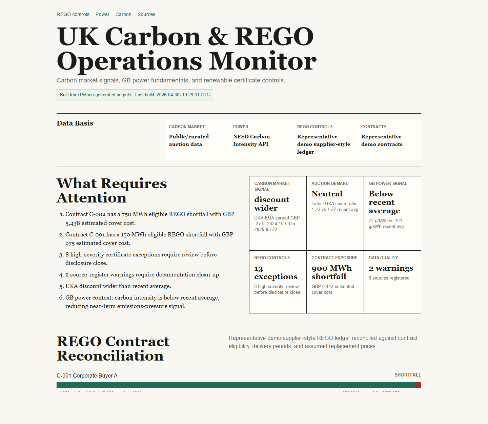

# UK Carbon & REGO Market Operations Monitor

This project is a public-facing analyst workflow connecting UK carbon market signals, GB power-system fundamentals, and renewable certificate reconciliation controls.

The aim is not to build a trading terminal. The aim is to show how a carbon / renewables analyst can turn fragmented market, power, certificate, and source data into decision-useful signals, contract coverage checks, exception reports, and documented assumptions.

## Why I Built This

Carbon analysis for a renewables supplier is not limited to allowance prices. It also depends on physical power-system conditions, renewable certificate evidence, contract delivery periods, source lineage, disclosure controls, and replacement-price assumptions.

## What The Monitor Does

- Uses official EEX EUA auction results, manually curated ICE UKA auction inputs, and GOV.UK UK ETS CCM monthly price context to build carbon-market context.
- Tracks UKA/EUA auction prices, a GBP-normalised spread using a stated EUR/GBP FX assumption, auction volume, and demand signals.
- Pulls live NESO Carbon Intensity API data during the Python build to analyse GB carbon intensity, gas share, renewable output, and physical emissions drivers.
- Uses a representative demo supplier-style REGO ledger and representative demo customer contracts.
- Reconciles certificate inventory against contract eligibility, delivery periods, counterparty records, lifecycle fields, and source evidence.
- Flags duplicate certificate IDs, missing IDs, invalid contract allocations, lifecycle errors, technology/country mismatches, vintage breaches, stale inventory, and source-quality issues.
- Calculates eligible matched MWh, shortfall/surplus, and estimated replacement exposure using assumed REGO prices in the contract file.

## Dashboard Screenshots

The first dashboard screen is designed to answer "what requires attention?" before showing detailed charts. It includes six executive signal cards and an analyst attention list that prioritises certificate shortfalls, high-severity controls, GB power-system drivers, carbon spread regime, and source-register warnings.



## Workflow Structure

```text
Raw / sample data
-> Python cleaning and validation
-> Python signal and reconciliation engine
-> Processed JSON / CSV outputs
-> Static HTML / CSS / JS dashboard
-> Analyst note and GitHub documentation
```

## Repository Structure

```text
index.html
assets/
data/raw/
data/processed/
src/
docs/
outputs/
```

The browser reads processed JSON files from `data/processed/`. Business logic lives in Python, not JavaScript.

Normal dashboard builds fetch public EEX, GOV.UK, and NESO inputs where automated sources are available, validate the manually curated ICE UKA CSV, then read the remaining raw input files already present under `data/raw/`. They do not regenerate representative demo data or overwrite curated UKA auction CSVs.

To intentionally reset the representative demo inputs, run:

```bash
python src/seed_demo_data.py
```

That seed command recreates the representative REGO ledger, representative contracts, initial carbon sample CSVs, FX assumption file, and source-register seed rows. It is separate from the scheduled refresh path and should not be used as the normal data-refresh command.

## Static Hosting And Data Refresh

GitHub Pages serves this project as static HTML, CSS, JavaScript, CSV, and JSON files. Python does not run in the visitor's browser.

Generated dashboard data is refreshed by GitHub Actions. The scheduled workflow runs `python src/build_all.py`, regenerates the processed JSON/CSV outputs, and commits changed generated files back to the repository so GitHub Pages can serve the latest static data.

## Data Sources And Limitations

Carbon market data in this project uses official/public or curated inputs rather than licensed live market feeds. EUA auction results are fetched from official EEX public primary-auction workbooks during the build. GOV.UK UK ETS Cost Containment Mechanism tables provide official monthly average futures-price and trigger-price context. UKA auction inputs are held in a manually curated ICE-source CSV and validated during the build. The dashboard shows the carbon market comparison period and does not imply the auction inputs are a live trading feed.

UKA auction prices are denominated in GBP. EUA auction prices are denominated in EUR, so the Python pipeline converts EUA values into GBP using the static EUR/GBP assumption in `data/raw/carbon/fx_assumptions.csv` before calculating the UKA-EUA spread. Because official EEX and UKA auction calendars differ, UKA dates are aligned to the nearest EUA auction date within 14 days. GOV.UK CCM monthly prices are shown separately from auction clearing prices. The spread is therefore labelled as a GBP spread and should be treated as a transparent auction-context indicator, not a live traded spread.

GB power data is fetched live from the official NESO Carbon Intensity API during `python src/build_all.py`. No API key is required. If the API or network is unavailable, the build fails clearly instead of silently substituting fake power data.

The carbon and power sections use public data, official public files, or curated public extracts. The REGO reconciliation module uses a representative demo ledger because certificate-level supplier allocations and customer contract mappings are internal operating data, not a public dataset.

Replacement REGO prices are assumptions stored in the contract file and are used only to demonstrate exposure logic.

## REGO Reconciliation Controls

The REGO control engine is the operational core. It validates certificate IDs, lifecycle dates, allocation status, contract references, technology/country eligibility, delivery-period vintage, source evidence, stale available inventory, missing counterparty records, and contract-level shortfalls.

See `docs/control_framework.md` for the full control register.

## Carbon Market Signal Methodology

The carbon module calculates latest UKA/EUA auction prices, converts EUA prices into GBP using the stated FX assumption, aligns UKA auction dates to nearby EUA auction dates where calendars differ, calculates the GBP-normalised UKA-EUA spread, trailing spread average, spread z-score, and a simple spread regime. It also surfaces the latest GOV.UK CCM monthly average futures price, trigger price, and triggered status as official UKA policy context. The method is deliberately transparent and avoids pretending to replicate a licensed live market terminal.

The dashboard separates carbon inputs into three labelled layers: official auction signal, official UKA CCM monthly context, and an optional market-reference layer that is intentionally not implemented in the MVP. This prevents auction results, policy trigger tables, and future third-party market references from being presented as the same type of data.

See `docs/carbon_market_driver_framework.md`.

## GB Power Fundamentals Methodology

The power module fetches recent live NESO Carbon Intensity API data, compares latest carbon intensity with the recent API window average, calculates gas and renewable shares, and identifies whether higher gas share, lower renewable output, or mixed generation effects are driving the signal.

## How To Run The Project

Install dependencies:

```bash
pip install -r requirements.txt
```

Run the full pipeline:

```bash
python src/build_all.py
```

This command requires internet access for the EEX EUA auction fetch, GOV.UK CCM table fetch, and NESO power module.

Validate the manually curated ICE UKA auction input:

```bash
python src/validate_uka_auction_input.py
```

See `data/raw/carbon/README_uka_manual_update.md` for the UKA update process.

Verify the REGO reconciliation business logic:

```bash
python -m unittest tests.test_rego_controls
```

The tests regenerate the representative demo REGO inputs, run the control engine, and assert the expected exception register, contract coverage, shortfall, surplus, and exposure values.

Serve the static dashboard locally:

```bash
cd "c:\Users\tanne\Desktop\Energy Project\uk-carbon-rego-monitor"
python -m http.server 8000
```

Then open:

```text
http://localhost:8000
```

Opening `index.html` directly with `file://` is not supported because the dashboard reads generated JSON files with browser `fetch()`. The page will show a visible instruction if it is opened this way.

If you see a Python file directory listing, the server was started from the wrong folder. Stop it and restart the server from the project root, not from `src/`.

## AI-Assisted Workflow Note

This project was built using AI-assisted coding tools for scaffolding, debugging, and documentation support. I manually reviewed the business logic, control definitions, assumptions, data limitations, and dashboard outputs.

## Future Extensions

- Optional automated ICE UKA ingestion if a stable public machine-readable source is confirmed.
- Optional charting of GOV.UK CCM monthly average price versus trigger price.
- Exportable exception report and control-owner fields.
- Dashboard screenshots in the README.
- Separate future projects for grid constraints, supplier screening, or firm-level ETS analysis.
